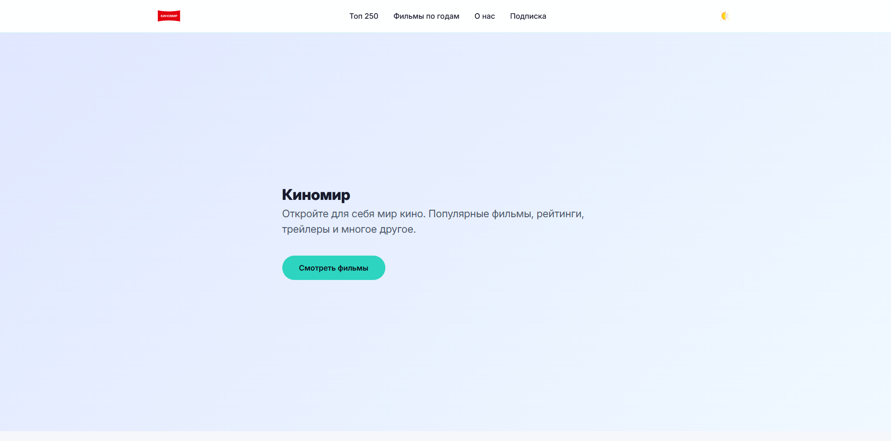
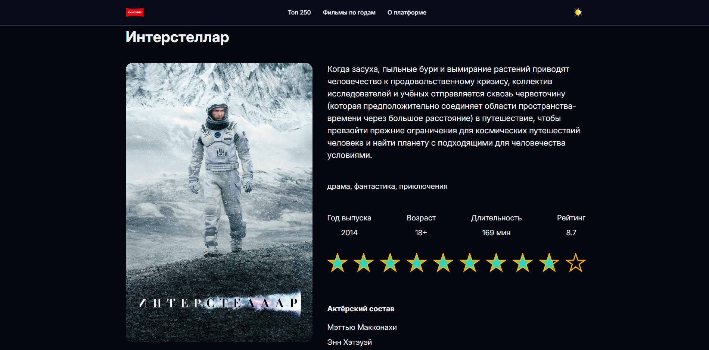
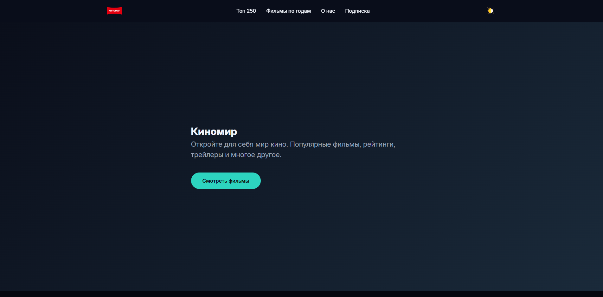

Киномир

Современный сайт для поиска фильмов, просмотра информации об актёрах и отслеживания рейтингов.
Цель проекта

Создать удобный и многофункциональный веб-сайт, где пользователи могут:
*   Просматривать популярные фильмы и топ-250.
*   Искать и фильтровать фильмы по годам.
*   Получать детальную информацию о фильмах и их актёрском составе.

 Используемые технологии

*   Frontend: HTML5, CSS3 (Flexbox/Grid), JavaScript
*   API: [Kinopoisk API Unofficial](https://kinopoiskapiunofficial.tech/) для получения данных о фильмах и актёрах
*   Хостинг: [GitHub Pages](https://pages.github.com/)

Основной функционал

*   Главная страница: Отображение популярных фильмов с возможностью подгрузки новых (кнопка "Показать ещё").
*   Страница "Топ-250": Список лучших фильмов с поиском, сортировкой и пагинацией.
*   Страница фильма: Детальная информация, включая описание, рейтинг, жанры и актёрский состав.
*   Страница актёра: Биография, фильмография, история просмотров с поиском по актёрам.
*   Тёмная тема: Переключение между светлой и тёмной темой интерфейса с сохранением выбора в `localStorage`.
*   Фильтры и поиск: Удобные инструменты для навигации по контенту.

Скриншоты

> Например:
> *   
> *   
> *   

Посетите работающий веб-сайт по адресу: [https://coffeecat45.github.io/kinomir/](https://coffeecat45.github.io/kinomir/)
